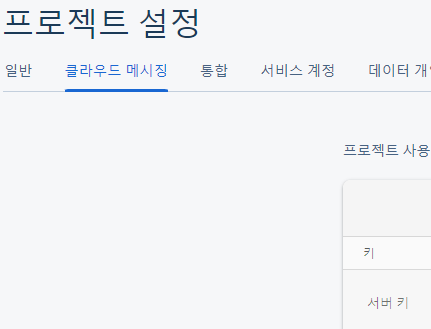
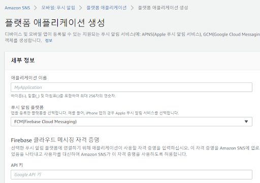
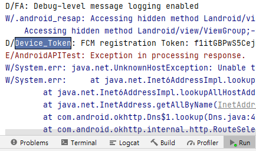
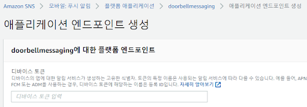

# Android 사용방법

MainActivity의 line 42url 읽어올 API 주소 변경

플랫폼 애플리케이션 생성

[Firebase 프로젝트를 생성](https://console.firebase.google.com/?hl=ko)한후 클라우드 메시징의 키 값 복사

복사한 키를 위와 같이 설정 후 API키로 지정

어플을 설치한 후

 Run의 Device_Token을 복사하여 AWS의 디바이스 토큰에 입력합니다.

